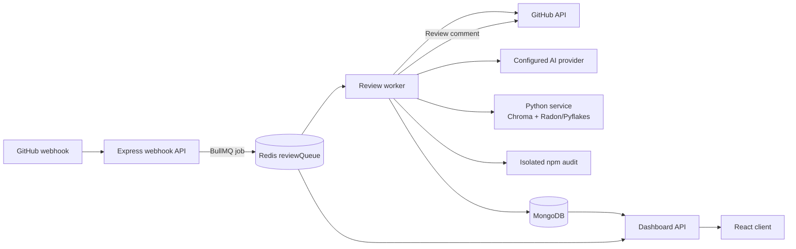

# PRism System Design

## Component diagram

Repositories can select OpenAI, Gemini, or Claude through a normalized provider interface.

## Data flow walkthrough

1. GitHub sends a signed webhook. Express preserves the raw body, verifies HMAC-SHA256, assigns a UUID request ID, rejects duplicate delivery/commit pairs, and returns `202` immediately.
2. Repository metadata is upserted and a small payload (`repoId`, PR number, head SHA, delivery ID, request ID, enqueue time) crosses the first asynchronous boundary into Redis/BullMQ.
3. A worker claims the job. BullMQ supplies concurrency control, three attempts, and exponential backoff starting at five seconds. AsyncLocalStorage restores the request ID for correlated logs.
4. The worker reloads the repository and PR from GitHub and rejects stale head SHAs. Token buckets delay GitHub or AI calls when local request budgets are exhausted.
5. Changed files are filtered. Source loading, deterministic lint/complexity analysis, and dependency-manifest audit begin in parallel. If the repository's monthly token budget remains, changed patches are also reviewed by the configured AI provider; otherwise only deterministic layers run.
6. AI candidates cross a network boundary to the Python service. Chroma checks known non-issues and suppresses strong matches. Radon/Pyflakes results and isolated `npm audit` advisories are merged as deterministic findings.
7. The worker posts one GitHub review, writes the completed review and usage/duration data to MongoDB, and BullMQ marks the job complete.
8. After the final failed attempt, the worker copies the full job payload and error into MongoDB's `FailedReview` collection. The dashboard's authenticated API lists, retries, or acknowledges these records.
9. The React dashboard reads reviews, metrics, queue depth, failures, token usage, and repository settings through JWT-protected Express endpoints.

## Failure modes considered

| Failure | Current handling |
|---|---|
| Duplicate webhook delivery | Unique delivery ID plus `(repository, prNumber, headSha)` index; duplicates are ignored. |
| GitHub API downtime | The worker throws; BullMQ retries three times with exponential backoff, then persists a dead letter. Token buckets reduce avoidable hard rate limits. |
| AI-provider timeout/rate pressure | Abort timeout and token bucket; failures retry the whole idempotent job. A completed review unique key prevents duplicate records. |
| Python service unavailable | Complexity, Python lint, and memory enrichment degrade gracefully and log warnings. This does not currently fail the whole review, so AI/JS lint feedback can still post. |
| MongoDB connection drop | Mongoose operations fail the job and BullMQ retries. A prolonged outage reaches BullMQ failed state; persisting the Mongo dead letter can also fail and is logged. A Redis-only dead-letter sweep is a future hardening item. |
| Redis/queue unavailable | Webhook enqueue fails after the response and is logged. Redis persistence/AOF protects accepted jobs once written. Returning `503` before `202` when Redis health is unavailable is a known gap. |
| Worker crash | Redis retains the job; BullMQ lock recovery makes it available to another worker. Review uniqueness protects reprocessing. |
| Stale PR commit | Worker compares the queued SHA with GitHub's current head and fails the obsolete job rather than commenting on the wrong revision. |

## Scaling bottleneck analysis

MongoDB queries are supported by indexes on `(repository, createdAt)` and unique `(repository, prNumber, headSha)`. These avoid repository-history and idempotency scans. At tens of millions of reviews, aggregations that unwind every finding will become the likely database bottleneck; retain 30/90-day rollups, archive old reviews, and add materialized per-repository metrics before that point. `FailedReview.failedAt` and `jobId` are indexed for operational paging.

A single worker at concurrency 2 is the first compute bottleneck once arrival rate exceeds two reviews per average review duration. For example, at a 60-second mean duration, sustained throughput above roughly two reviews per minute grows the queue. Increase `REVIEW_CONCURRENCY` only while GitHub, AI-provider, and Python capacity permits. Horizontal scaling is straightforward: run multiple identical worker processes or machines against the same Redis queue; BullMQ assigns each job to one worker. Separate webhook/API and worker deployments allow independent scaling.

AI-provider latency and quota are likely to dominate review throughput. Monitor provider limits before increasing worker concurrency aggressively. Chroma's local persistent store is appropriate for this scale but becomes a single-node constraint if workers move to multiple machines.

## Deliberate trade-offs

- **Chroma instead of a managed vector database:** no hosted bill, little infrastructure, and sufficient retrieval quality at the current repository count. The trade-off is weaker multi-node availability and operational tooling.
- **MongoDB instead of PostgreSQL:** findings, complexity results, and provider metadata evolve naturally as nested documents. The trade-off is less relational enforcement and more care around aggregation cost.
- **Separate Python service:** Python has the stronger embedding, Radon, Pyflakes, and NLP ecosystem. The explicit cost is another deployable service and a network hop on every enrichment request; enrichment therefore degrades gracefully.
- **BullMQ and Redis:** durable retries and horizontal workers are simpler than custom Mongo polling. Redis is an additional stateful dependency, mitigated by AOF and free-tier/local options.
- **Multi-provider AI:** repositories can choose among OpenAI, Gemini, and Claude. The trade-offs are external service availability, quota management, and provider-specific billing.
- **In-process token buckets:** simple and sufficient for one worker process. Multiple workers each have a bucket, so a Redis-backed distributed limiter is required when horizontally scaling under a shared provider quota.
